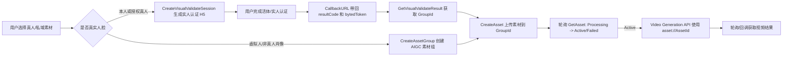
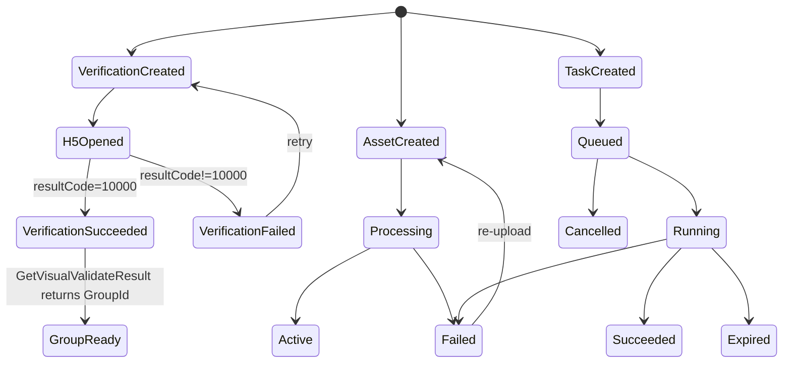

# Seedance 2.0 真人与私域素材接入通路

> 面向产品和研发的方案梳理。基于 BytePlus ModelArk 官方文档整理，访问日期：2026-06-08。

## 1. 结论先行

Seedance 2.0 涉及真人素材时，核心不是把用户上传的图片或视频直接传给模型，而是先把素材变成 BytePlus 认可的可信资产：

1. 真人本人授权：先走实人认证 H5/API，生成该真人对应的 `Asset Group`。
2. 素材入库：把图片、视频、音频上传到该 `Asset Group`，等待 BytePlus 审核和预处理。
3. 生成视频：素材状态变成 `Active` 后，用 `asset://<AssetId>` 填到 Video Generation API 的 `content.*_url.url` 字段里。
4. Prompt 里不能直接写 `AssetId`，要按请求体顺序引用，例如 `Image 1`、`Video 1`、`Audio 1`。

一句话通路：



## 2. 关键概念

| 概念 | 含义 | 我们产品里的建议叫法 |
| --- | --- | --- |
| `Asset Group` | 素材组。真人库里每个组只能对应一个真人；虚拟素材库里用于管理一组相关素材。 | 人物档案 / 素材组 |
| `GroupId` | 素材组 ID。真人认证成功后由 `GetVisualValidateResult` 返回；虚拟素材由 `CreateAssetGroup` 返回。 | 人物档案 ID |
| `Asset` | 一条可信素材，支持图片、视频、音频。 | 素材 |
| `AssetId` | 素材入库后返回的 ID，例如 `asset-...`。 | 素材 ID |
| `Asset URI` | 视频生成时实际传给模型的 URI，格式 `asset://<AssetId>`。 | 模型可用素材 |
| `ProjectName` | BytePlus 项目隔离字段。素材和推理 endpoint 必须在同一项目下。 | 工作区 / 项目 |
| `Status` | 素材预处理状态，常见为 `Processing`、`Active`、`Failed`。 | 审核中 / 可用 / 失败 |

重要约束：

- Seedance 2.0 不支持把含真实人脸的参考图或视频直接作为普通 URL 上传给模型。真人素材需要使用授权真人资产、预置数字角色或可信输出等路径。
- 只有 `Active` 状态的素材才能用于生成。
- 上传接口是异步的，视频素材入库耗时会更长，官方不保证上传完成 SLA。
- `ProjectName` 会隔离素材和推理 endpoint。上传、查询、生成必须使用同一个项目，否则会出现素材已上传但查询不到或生成不可用的问题。

## 3. 真人素材链路

适用场景：

- 用户要使用自己的真人肖像生成视频。
- 用户有真人授权，需要在产品内做一次实人/活体认证后持续复用该人物素材。

### 3.1 前置条件

研发侧需要准备：

- BytePlus AK/SK，用于 Assets API，区域按官方示例为 `ap-southeast-1`。
- 权限：官方示例要求对应项目具备 `ArkFullAccess`；虚拟素材库文档也给出可覆盖素材能力的 `ark:*Asset*` IAM Action 示例。
- ModelArk API Key，用于 Video Generation API。
- 已购买或开通 Seedance 2.0 Advanced Creation Rights。真人库和私域虚拟肖像库共享容量额度。
- 后端可访问的 `CallbackURL`，用于接收实人认证结果。

### 3.2 Step 1：创建实人认证会话

后端调用 BytePlus OpenAPI：

| 字段 | 值 |
| --- | --- |
| `ServiceName` | `ark` |
| `Action` | `CreateVisualValidateSession` |
| `Version` | `2024-01-01` |
| `HttpMethod` | `POST` |
| `ContentType` | `application/json` |

请求核心字段：

| 字段 | 必填 | 说明 |
| --- | --- | --- |
| `CallbackURL` | 是 | 用户完成认证后跳回的地址，BytePlus 会附加认证结果参数。 |
| `ProjectName` | 否 | 默认 `default`。建议我们显式传入，避免跨项目问题。 |

返回核心字段：

- `H5Link`：给用户打开的实人认证页面链接。
- `BytedToken`：本次认证的凭证，用于后续查询 `GroupId`。

产品体验建议：

- 前端不要自己拼 H5 参数。由后端创建认证会话后，把短时有效的 `H5Link` 返回给前端。
- H5 链接有效期为 120 秒。页面上需要显示倒计时或过期重试。
- H5 支持语言参数：`zh`、`en`、`zh-Hant`，默认 `zh`。

### 3.3 Step 2：接收认证结果并查询 GroupId

用户完成 H5 实人认证后，BytePlus 会打开我们的 `CallbackURL`，并附加类似参数：

```text
<CallbackURL>?bytedToken=...&resultCode=10000&algorithmBaseRespCode=0&reqMeasureInfoValue=1&verify_type=real_time
```

字段处理：

| 字段 | 说明 |
| --- | --- |
| `resultCode` | `10000` 表示认证成功。其他值按失败处理，并展示重试入口。 |
| `bytedToken` | 查询本次认证结果和 `GroupId` 的凭证。 |
| `algorithmBaseRespCode` | 服务端子错误码。认证失败时用于问题定位。 |
| `reqMeasureInfoValue` | 是否计费，`0` 或 `1`。 |
| `verify_type` | 当前固定为 `real_time`。 |

认证成功后，后端调用：

| 字段 | 值 |
| --- | --- |
| `ServiceName` | `ark` |
| `Action` | `GetVisualValidateResult` |
| `Version` | `2024-01-01` |
| `HttpMethod` | `POST` |

请求核心字段：

| 字段 | 必填 | 说明 |
| --- | --- | --- |
| `BytedToken` | 是 | 来自认证会话或 CallbackURL。官方提示有效期为 120 秒。 |
| `ProjectName` | 否 | 必须与创建认证会话时一致。 |

返回核心字段：

```json
{
  "GroupId": "group-..."
}
```

我们需要持久化：

- 我们自己的用户 ID。
- BytePlus `GroupId`。
- `ProjectName`。
- 认证状态和时间。
- 授权版本、授权文案版本、用户确认记录。

### 3.4 Step 3：上传真人素材

后端调用：

| 字段 | 值 |
| --- | --- |
| `ServiceName` | `ark` |
| `Action` | `CreateAsset` |
| `Version` | `2024-01-01` |
| `HttpMethod` | `POST` |

请求核心字段：

| 字段 | 必填 | 说明 |
| --- | --- | --- |
| `GroupId` | 是 | 实人认证得到的素材组 ID。 |
| `URL` | 是 | BytePlus 可访问的图片、视频或音频 URL。 |
| `AssetType` | 是 | `Image`、`Video` 或 `Audio`。 |
| `Name` | 否 | 仅用于管理和模糊搜索，不会进入模型推理。 |
| `Moderation` | 否 | 默认走 Content Pre-filter。设置 `{"Strategy":"Skip"}` 需要先在控制台关闭对应预审策略，且仍要满足底线安全策略。 |
| `ProjectName` | 否 | 建议必传，且与认证和推理项目一致。 |

真人素材会额外做一致性校验：

- 上传图片会和实人认证采集的基准图做人脸特征一致性比对。
- 如果判断不是同一个人，上传失败。
- 如果素材里检测到多张脸，无法上传。

上传后调用 `GetAsset` 轮询：

| 状态 | 产品状态 | 处理 |
| --- | --- | --- |
| `Processing` | 审核/处理中 | 展示等待态，后台继续轮询。 |
| `Active` | 可用 | 允许进入生成流程。 |
| `Failed` | 入库失败 | 展示原因，允许换素材重传。 |

推荐上传引导：

- 人像素材尽量提供同一人的多张资产，放入同一个 `GroupId`。
- 全身参考图：竖版、正面、全身。
- 脸部特写：竖版、正面、无明显表情、肩部以上，脸部约占画面三分之二。
- 图片格式可支持 `jpeg/png/webp/bmp/tiff/gif/heic/heif`，宽高比建议在 `(0.4, 2.5)`，宽高像素 `(300, 6000)`，单张图片小于 30 MB。

## 4. 私域虚拟肖像素材链路

适用场景：

- 虚拟人、AIGC 角色、无真实人格权益风险的角色素材。
- 品牌自有图片、视频、音频素材，希望通过素材库审核后作为 Seedance 2.0 输入。

关键差异：

- 不走实人认证 H5。
- 先调用 `CreateAssetGroup` 创建素材组。
- 首次创建资产组前，官方要求在控制台签署授权书。
- `GroupType` 当前官方文档说明只支持 `AIGC`。

### 4.1 创建虚拟素材组

后端调用：

| 字段 | 值 |
| --- | --- |
| `ServiceName` | `ark` |
| `Action` | `CreateAssetGroup` |
| `Version` | `2024-01-01` |
| `HttpMethod` | `POST` |

请求核心字段：

| 字段 | 必填 | 说明 |
| --- | --- | --- |
| `Name` | 是 | 素材组名称。 |
| `Description` | 否 | 素材组说明。 |
| `GroupType` | 否 | 默认 `AIGC`，当前仅支持 `AIGC`。 |
| `ProjectName` | 否 | 默认 `default`，建议必传。 |

### 4.2 上传虚拟素材

调用 `CreateAsset`，字段与真人素材一致：

- `GroupId`
- `URL`
- `AssetType`
- `Name`
- `Moderation`
- `ProjectName`

虚拟素材的合规要求要前置到产品确认：

- 上传者合法拥有该资产并有完整使用、处置权。
- 不包含未授权第三方商标或 Logo。
- 不得像真实人物肖像，不得抄袭、盗用或侵害第三方人格权、知识产权或其他合法权益。
- 不包含违法违规、公序良俗或国家安全风险内容。

## 5. 视频生成链路

创建视频任务：

```http
POST https://ark.ap-southeast.bytepluses.com/api/v3/contents/generations/tasks
Authorization: Bearer $ARK_API_KEY
Content-Type: application/json
```

> 注：官方不同示例中域名有 `ap-southeast` 和 `ap-southeast-1` 写法，正式接入前需要以控制台模型 endpoint 和最新官方示例为准。

请求核心字段：

| 字段 | 必填 | 说明 |
| --- | --- | --- |
| `model` | 是 | 模型 ID 或 endpoint ID。建议生产使用 endpoint ID，便于限流、计费、监控和安全策略管理。 |
| `content` | 是 | 输入内容数组，支持 text/image/video/audio/sample task。 |
| `callback_url` | 否 | 任务状态变化时回调。结构与查询任务 API 返回一致。 |
| `return_last_frame` | 否 | 是否返回生成视频最后一帧，默认 `false`。 |
| `generate_audio` | 否 | Seedance 2.0 支持，默认 `true`。 |
| `resolution` | 否 | Seedance 2.0 默认 `720p`，可选值需以模型能力为准。 |
| `ratio` | 否 | Seedance 2.0 默认 `adaptive`，可选 `16:9`、`4:3`、`1:1`、`3:4`、`9:16`、`21:9`、`adaptive`。 |
| `duration` | 否 | Seedance 2.0 支持 `[4,15]` 秒或 `-1` 智能选择。 |
| `frames` | 否 | 和 `duration` 二选一，`frames` 优先。 |
| `seed` | 否 | 默认 `-1`，相同 seed 只能提高相似性，不保证完全一致。 |
| `priority` | 否 | Seedance 2.0 支持 `0-9`，影响同一 endpoint 下排队顺序。 |
| `safety_identifier` | 否 | 终端用户唯一标识，建议传用户 ID 的哈希，长度不超过 64。 |
| `watermark` | 否 | 默认 `false`。 |

`content` 示例：

```json
{
  "model": "dreamina-seedance-2-0-260128",
  "content": [
    {
      "type": "text",
      "text": "让 Image 1 中的人物穿着 Image 2 的衣服，在雨中向镜头微笑。"
    },
    {
      "type": "image_url",
      "role": "reference_image",
      "image_url": {
        "url": "asset://asset-xxxx"
      }
    },
    {
      "type": "image_url",
      "role": "reference_image",
      "image_url": {
        "url": "asset://asset-yyyy"
      }
    }
  ],
  "generate_audio": true,
  "ratio": "16:9",
  "duration": 8,
  "watermark": true
}
```

Prompt 设计规则：

- 用 `Image 1`、`Image 2`、`Video 1`、`Audio 1` 引用素材。
- 序号来自请求体中同类型素材的顺序。
- 不要在 prompt 中直接写 `asset-...` 或 `asset://...`。
- 产品侧建议在 prompt 编辑器里把素材渲染成可排序的「图片 1」「视频 1」标签，避免用户写错编号。

任务结果：

- 创建任务返回 `id`。
- 任务是异步的，需要轮询 `GET /api/v3/contents/generations/tasks/{id}` 或等待 `callback_url`。
- 状态包括 `queued`、`running`、`succeeded`、`failed`、`expired`、`cancelled`。
- 任务 ID 只保留 7 天，过期后会被清理。
- 成功后在查询结果的 `content` 中获取生成视频 URL。

## 6. 推荐产品体验

### 6.1 首次使用

入口建议拆成两条：

1. 使用我的真人形象
   - 展示授权说明和用途。
   - 开始实人认证。
   - 认证成功后创建「我的人物档案」。
   - 引导上传素材。

2. 使用虚拟/品牌人物素材
   - 展示版权和非真人肖像承诺。
   - 创建素材组。
   - 上传素材并等待审核。

### 6.2 素材库页面

每个素材组展示：

- 名称、类型：真人 / 虚拟。
- 认证状态：未认证 / 已认证 / 已过期或失败。
- 素材数量。
- 可用素材数。
- 最近一次入库失败原因。
- 所属 `ProjectName`，研发模式或后台可见。

每个素材展示：

- 缩略图或文件名。
- 类型：图片 / 视频 / 音频。
- 状态：审核中 / 可用 / 失败。
- 失败原因和重传入口。
- 是否可用于生成。

### 6.3 生成页

生成页不要让用户感知 `AssetId`：

- 用户选择素材后，系统自动插入 `Image 1`、`Video 1` 等引用。
- 用户调整素材顺序时，prompt 中编号要同步提醒或自动更新。
- 如果素材不是 `Active`，按钮置灰并提示「素材仍在审核中」。
- 如果用户上传含人脸的新素材，先引导入库，不能直接进入生成。

### 6.4 失败态

| 场景 | 产品提示 | 动作 |
| --- | --- | --- |
| H5 链接过期 | 认证链接已过期 | 重新创建认证会话 |
| 实人认证失败 | 认证未通过 | 允许重试，展示基础原因 |
| `GroupId` 查询失败 | 认证结果同步中 | 短时间轮询，超时后重试认证 |
| 素材 `Processing` | 素材审核中 | 展示预计等待，不允许生成 |
| 素材 `Failed` | 素材未通过 | 展示失败原因，允许替换 |
| 视频 `failed` | 生成失败 | 展示失败原因，允许重新生成 |
| 视频 `expired` | 任务超时 | 允许重新提交，必要时降低复杂度 |

## 7. 推荐研发设计

### 7.1 后端服务边界

建议至少拆 3 个内部模块：

| 模块 | 责任 |
| --- | --- |
| `identity-verification` | 创建实人认证 H5、处理 callback、查询 `GroupId`。 |
| `asset-library` | 创建素材组、上传素材、轮询资产状态、管理素材元数据。 |
| `video-generation` | 创建视频任务、轮询任务状态、接收视频 callback、存储结果。 |

### 7.2 数据模型草案

`real_person_verifications`

| 字段 | 说明 |
| --- | --- |
| `id` | 我们自己的认证记录 ID。 |
| `user_id` | 用户 ID。 |
| `provider` | `byteplus`。 |
| `byted_token_hash` | 不建议明文长期存 token，可存哈希或短期缓存。 |
| `group_id` | BytePlus `GroupId`。 |
| `project_name` | BytePlus 项目名。 |
| `status` | `created/h5_opened/succeeded/failed/expired`。 |
| `callback_payload` | 脱敏后的回调参数。 |
| `created_at/updated_at` | 时间。 |

`asset_groups`

| 字段 | 说明 |
| --- | --- |
| `id` | 我们自己的素材组 ID。 |
| `provider_group_id` | BytePlus `GroupId`。 |
| `owner_user_id` | 归属用户。 |
| `group_type` | `LivenessFace` 或 `AIGC`。 |
| `project_name` | BytePlus 项目名。 |
| `display_name` | 前台展示名。 |
| `status` | 可用 / 禁用 / 删除。 |

`assets`

| 字段 | 说明 |
| --- | --- |
| `id` | 我们自己的素材 ID。 |
| `provider_asset_id` | BytePlus `AssetId`。 |
| `asset_uri` | `asset://<AssetId>`。 |
| `group_id` | 我们自己的素材组 ID。 |
| `asset_type` | `Image/Video/Audio`。 |
| `source_url` | 我们上传给 BytePlus 的源文件 URL。 |
| `status` | `Processing/Active/Failed`。 |
| `moderation_strategy` | `Default/Skip`。 |
| `provider_payload` | 脱敏后的 BytePlus 返回。 |

`video_generation_tasks`

| 字段 | 说明 |
| --- | --- |
| `id` | 我们自己的任务 ID。 |
| `provider_task_id` | BytePlus task `id`。 |
| `user_id` | 用户 ID。 |
| `model_or_endpoint` | 模型 ID 或 endpoint ID。 |
| `content_snapshot` | 生成时的素材顺序和 prompt 快照。 |
| `status` | `queued/running/succeeded/failed/expired/cancelled`。 |
| `result_url` | 成功后的视频 URL。 |
| `error` | 失败信息。 |

### 7.3 状态机



### 7.4 安全与合规

- AK/SK 和 ARK API Key 只放后端，不下发给客户端。
- 前端只接收短时有效 H5 链接，不接触 `CreateVisualValidateSession` 的签名逻辑。
- 用户授权、素材上传承诺、肖像权和版权确认要独立留痕。
- `CallbackURL` 建议带我们自己的 `state` 或一次性 nonce，回调时校验归属，避免串单。
- 对 `ProjectName` 做服务端枚举，不接受前端任意传入。
- `Moderation.Strategy=Skip` 要作为受控能力，默认不开放给普通用户。
- `safety_identifier` 使用用户 ID 哈希，不传明文邮箱或手机号。

### 7.5 生成内容归档

作品库不能只依赖 ModelArk 历史任务记录：

- `List video generation tasks` 只能查询最近 7 天任务，且范围受当前 API Key 权限限制。
- 成功任务的 `content.video_url` 和 `content.last_frame_url` 通常只有 24 小时有效。
- List/Retrieve 文档未承诺返回原始 prompt 或输入素材，因此产品侧要自己保存请求参数、会话上下文和最终成片文件。
- 成功任务同步到作品库时，应先记录上游原始任务 JSON，再尽快把可访问的 `video_url` 下载到本地或对象存储。

## 8. MVP 接入建议

第一阶段只做稳定闭环：

1. 只支持图片真人素材入库。
2. 只支持一个默认 `ProjectName`。
3. 真人链路必须先完成实人认证，再上传素材。
4. 素材必须 `Active` 后才能进入生成页。
5. 生成页只支持 `text + 1-3 张 image asset`。
6. 任务结果用轮询实现，callback 作为第二阶段增强。

第二阶段再做：

- 视频和音频素材入库。
- 多人物、多素材组管理。
- 视频任务 callback。
- 队列优先级、失败自动重试。
- 素材顺序可视化和 prompt 自动编号。
- 多项目、多 endpoint 配置。

## 9. 待确认项

接入前需要向 BytePlus 或控制台确认：

1. 生产可用的 Seedance 2.0 模型 ID 或 endpoint ID。官方示例里出现过 `dreamina-seedance-2-0-260128` 和 `seedance-2-0-260128` 两种写法，应以控制台为准。
2. 最终 API Base URL：Video Generation 官方页面和示例中有 `ap-southeast` / `ap-southeast-1` 差异。
3. Advanced Creation Rights 的容量、计费、并发和 QPS/QPM 限制。
4. 实人认证失败码和可展示给用户的错误文案映射。
5. `CreateAsset` 的素材 URL 是否必须公网可访问、有效期要求、是否支持我们自有对象存储签名 URL。
6. 是否允许关闭 Content Pre-filter，以及关闭后的责任边界。
7. Callback 是否有官方签名校验机制；如果没有，我们需要用自有 `state/nonce` 做防串单。

## 10. 官方资料

- 真人素材库 / 实人认证流程：[Private real-human asset library guide](https://docs.byteplus.com/en/docs/ModelArk/2333589)，官方更新时间 2026-06-03。
- 私域虚拟肖像素材库：[Private virtual portrait library](https://docs.byteplus.com/en/docs/ModelArk/2333565)，官方更新时间 2026-06-03。
- 视频生成 API 总览：[Video generation API](https://docs.byteplus.com/en/docs/ModelArk/Video_Generation_API)。
- 创建视频任务：[Create a video generation task](https://docs.byteplus.com/en/docs/ModelArk/1520757)，官方更新时间 2026-05-20。
- 查询视频任务：[Retrieve a video generation task](https://docs.byteplus.com/en/docs/ModelArk/1521309)，官方更新时间 2026-05-21。
- 列出视频任务：[List video generation tasks](https://docs.byteplus.com/en/docs/ModelArk/1521675)，官方更新时间 2026-05-21。
- 取消或删除视频任务：[Cancel or delete a video generation task](https://docs.byteplus.com/en/docs/ModelArk/1521720)，官方更新时间 2025-12-17。
