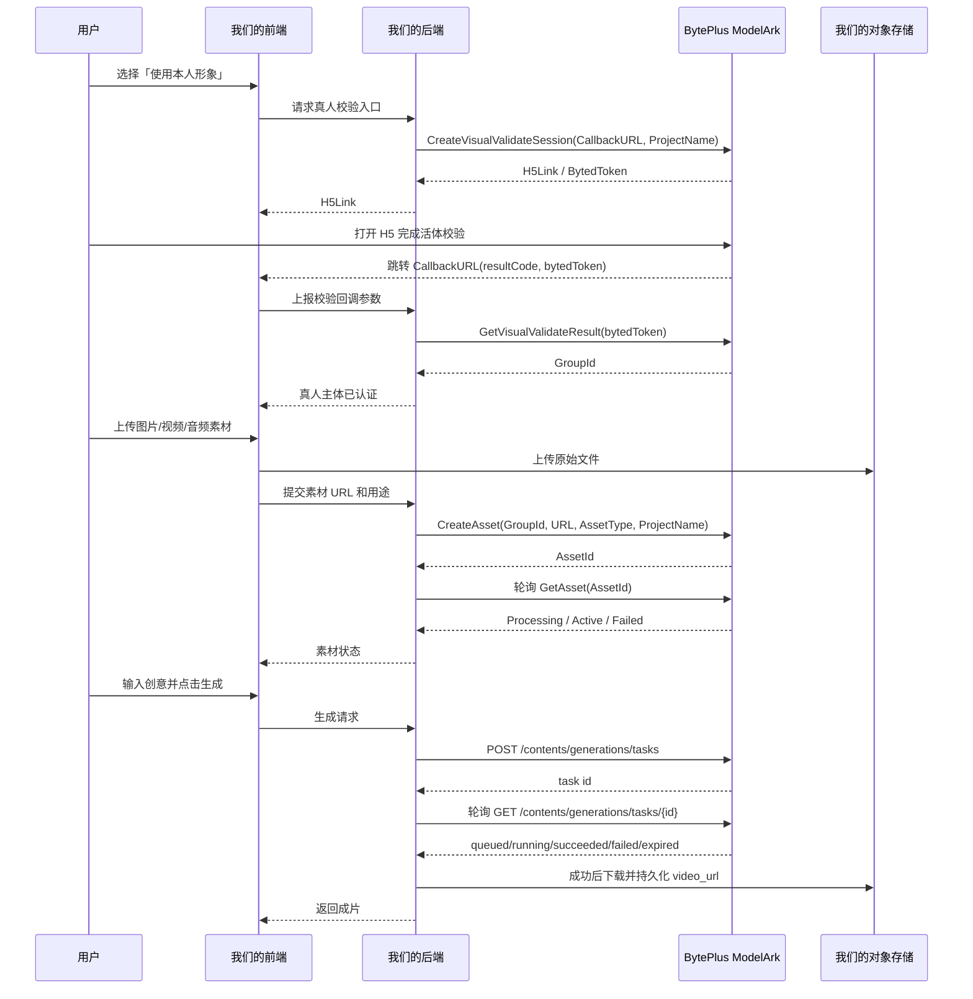
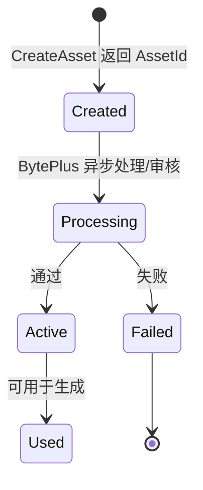

# Seedance 2.0 真人素材与视频生成通路设计

本文面向产品和研发，梳理 BytePlus ModelArk 中「真人校验、私域素材库、Seedance 2.0 视频生成」三段能力如何串起来，并给出我们产品体验与后端设计建议。

## 参考资料

- 真人素材库指南：<https://docs.byteplus.com/en/docs/ModelArk/2333589>
- 私域虚拟肖像素材库：<https://docs.byteplus.com/en/docs/ModelArk/2333565>
- 视频生成 API：<https://docs.byteplus.com/en/docs/ModelArk/Video_Generation_API>
- 创建视频任务：<https://docs.byteplus.com/en/docs/modelark/1520757>
- 查询视频任务：<https://docs.byteplus.com/en/docs/ModelArk/1521309>

## 结论

我们的业务通路应拆成三个关卡：

1. 本人授权与活体校验：只针对真人肖像。用户首次使用本人素材时走 H5 活体校验，校验通过后拿到 `GroupId`。同一个真人后续新造型、新穿搭、新动作素材上传到同一个 `GroupId`，不需要重复做真人校验。
2. 素材入库与审核：图片、视频、音频等素材先进入私域素材库。BytePlus 侧异步处理并审核，返回 `AssetId`，只有 `Active` 状态的素材才能传给模型。
3. 模型生成：调用 Seedance 2.0 创建异步视频任务，把可用素材以 `asset://<AssetId>` 作为 `content.*_url.url` 传入。Prompt 内不要写 asset id，而是按输入顺序写 `Image 1`、`Video 1`、`Audio 1`。

## 核心概念

| 概念 | 含义 | 产品/研发注意点 |
| --- | --- | --- |
| `AssetGroup` | 素材分组。真人库中一个 group 绑定一个真人；虚拟库中用于灵活管理同一角色/同一系列素材。 | 真人 group 不应混入其他人的脸。 |
| `GroupId` | 素材分组 ID。真人活体校验通过后由 `GetVisualValidateResult` 返回。 | 我们需要和用户、真人主体、项目 `ProjectName` 绑定存储。 |
| `Asset` | 已入库的单个图片、视频或音频素材。 | 只有入库并通过处理/审核的素材能用于推理。 |
| `AssetId` | BytePlus 返回的素材 ID。 | 后端存储，不直接暴露给用户编辑 prompt。 |
| `Asset URI` | 模型调用时使用的 URI，格式为 `asset://<AssetId>`。 | 放在 `image_url.url`、`video_url.url`、`audio_url.url`。 |
| `ProjectName` | BytePlus 资源项目名，默认 `default`。 | 素材库与模型 endpoint 必须在同一项目，否则会出现素材查不到或不能生成。 |
| `Status` | 素材或任务状态。 | 素材 `Active` 才能生成；任务 `succeeded` 才有结果视频。 |

## 总体流程



## 通路一：真人 SDK / 真人素材库

目标是验证「用户本人在使用本人素材」，降低肖像权和 Deepfake 风险。

### 首次使用

1. 用户确认授权协议和用途。
2. 后端调用 `CreateVisualValidateSession` 生成真人校验 H5 链接。
3. 请求中传 `CallbackURL` 和 `ProjectName`。
4. H5 链接有效期为 120 秒，用户需要在有效期内完成认证。
5. 用户认证完成后，BytePlus 跳转到 `CallbackURL`，并附带参数：
   - `bytedToken`：本次认证的凭证，用于查询 group。
   - `resultCode`：`10000` 表示真人认证成功。
   - `algorithmBaseRespCode`：服务端子错误码。
   - `reqMeasureInfoValue`：是否计费，`0` 或 `1`。
   - `verify_type`：当前固定为 `real_time`。
6. 若 `resultCode=10000`，后端调用 `GetVisualValidateResult`，拿到本次认证创建的 `GroupId`。
7. 我们把 `GroupId` 绑定到用户和真人主体。

### 后续使用

同一个真人不需要重复活体认证。用户上传新造型、新衣服、新照片、新动作素材时，直接把素材上传到该真人对应的 `GroupId`。

注意：一个真人 `AssetGroup` 只能关联一个真人。上传真人素材时，BytePlus 会把素材中的脸和活体校验采集的基准图做人脸一致性比对；如果不是同一人，或者素材中检测到多张脸，上传会失败。

## 通路二：私域素材库

目标是把图片、视频、音频等素材先变成 BytePlus 可信资产，再用于 Seedance 2.0 推理。

### 真人素材入库

真人素材入库依赖 `GroupId`：

```json
{
  "GroupId": "group-xxxx",
  "URL": "https://our-cdn.example.com/user/material.jpg",
  "AssetType": "Image",
  "Name": "front-face-v1",
  "ProjectName": "default"
}
```

关键字段：

| 字段 | 说明 |
| --- | --- |
| `GroupId` | 必填，真人活体校验后得到的 group。 |
| `URL` | 必填，可公开访问的图片、视频或音频 URL。 |
| `AssetType` | 必填，`Image`、`Video` 或 `Audio`。 |
| `Name` | 可选，只用于资产管理和 `ListAssets` 模糊搜索，不参与模型推理。 |
| `Moderation` | 可选，默认开启内容预审核。`{"Strategy":"Skip"}` 只能跳过大部分非基线内容安全策略，不能跳过所有安全策略，并且需要控制台提前开启相关能力。 |
| `ProjectName` | 可选，默认 `default`。必须和后续模型 endpoint 所在项目一致。 |

真人图片建议：

- 全身参考图：竖图、正面全身。
- 面部近景：竖图、正面无表情、肩部以上、脸部约占画面三分之二。

### 虚拟肖像/非真人素材入库

虚拟素材库用于不是真人肖像的角色或可信素材。首次创建虚拟素材组时，需要在控制台签署授权书。素材必须满足：

- 我们合法拥有或已获得完整使用和处置权。
- 不包含未授权第三方商标或 logo。
- 不得相似于任何真实自然人的肖像或形象。
- 不得抄袭、挪用或侵犯第三方人格权、知识产权等权益。
- 不含违法违规、公序良俗或国家安全风险内容。

API 通路：

1. `CreateAssetGroup` 创建素材组，`GroupType` 默认 `AIGC`。
2. `CreateAsset` 上传素材到 group。
3. `GetAsset` 轮询素材状态。
4. `ListAssets`、`ListAssetGroups` 做资产管理。

### 素材状态机



产品侧状态建议：

| BytePlus 状态 | 用户可见状态 | 允许操作 |
| --- | --- | --- |
| `Processing` | 审核/处理中 | 不允许生成，可取消或删除。 |
| `Active` | 可使用 | 可加入生成任务。 |
| `Failed` | 未通过 | 展示原因，允许重新上传。 |

## 通路三：Seedance 2.0 模型调用

### 创建任务

创建视频生成任务接口：

```http
POST https://ark.ap-southeast.bytepluses.com/api/v3/contents/generations/tasks
Authorization: Bearer ${ARK_API_KEY}
```

模型调用 API 使用 API Key 认证。素材库相关 API 使用 AK/SK 认证，两套鉴权不要混用。

基础请求示例：

```json
{
  "model": "dreamina-seedance-2-0-260128",
  "content": [
    {
      "type": "text",
      "text": "The woman in Image 1 wears the outfit in Image 2 and dances in a studio. Use the rhythm from Audio 1."
    },
    {
      "type": "image_url",
      "image_url": {
        "url": "asset://asset-person-front"
      },
      "role": "reference_image"
    },
    {
      "type": "image_url",
      "image_url": {
        "url": "asset://asset-outfit"
      },
      "role": "reference_image"
    },
    {
      "type": "audio_url",
      "audio_url": {
        "url": "asset://asset-music"
      }
    }
  ],
  "generate_audio": true,
  "ratio": "9:16",
  "duration": 11,
  "resolution": "720p",
  "watermark": true,
  "safety_identifier": "hash_user_id_64_chars_max",
  "callback_url": "https://api.example.com/byteplus/video-task-callback"
}
```

关键规则：

- Seedance 2.0 不支持直接上传带真人脸的参考图片或视频。要使用真人肖像，必须走官方支持路径：授权真人资产、预设数字人物，或特定模型生成且仍在可信期限内的原始输出。
- 图片、视频、音频都可以通过 `asset://<AssetId>` 传给模型。
- Prompt 里用 `Image 1`、`Video 1`、`Audio 1` 引用素材，编号取决于请求体中同类型素材的顺序；不要把 `AssetId` 写进 prompt。
- 音频不能单独输入，至少要有一个图片或视频参考。
- `callback_url` 可用于异步接收状态变化；也可以轮询查询任务。
- 生成结果 `video_url` 只保留 24 小时，我们必须及时下载到自己的对象存储。

### 支持的输入组合

Seedance 2.0 支持：

- 文本。
- 文本可选 + 图片。
- 文本可选 + 视频。
- 文本可选 + 图片 + 音频。
- 文本可选 + 图片 + 视频。
- 文本可选 + 视频 + 音频。
- 文本可选 + 图片 + 视频 + 音频。

多模态参考限制：

| 类型 | 数量 | 规格 |
| --- | --- | --- |
| 图片 | 1-9 张 | URL、Base64 或 `asset://`；单图小于 30 MB；请求体不超过 64 MB；大文件不建议 Base64。 |
| 视频 | 0-3 个 | URL 或 `asset://`；mp4/mov；单个 2-15 秒，总时长不超过 15 秒；单个不超过 50 MB；FPS 24-60。 |
| 音频 | 0-3 个 | URL、Base64 或 `asset://`；wav/mp3；单个 2-15 秒，总时长不超过 15 秒；单个不超过 15 MB。 |

### 输出控制参数

| 参数 | 建议默认 | 说明 |
| --- | --- | --- |
| `generate_audio` | `true` | Seedance 2.0 支持同步音频。若输入音频是参考音乐，仍需通过 prompt 说明如何使用。 |
| `ratio` | 按场景设置 | 可选 `16:9`、`4:3`、`1:1`、`3:4`、`9:16`、`21:9`、`adaptive`。短视频场景默认 `9:16`。 |
| `duration` | `8` 或 `11` | Seedance 2.0 支持 `4-15` 秒，也可设 `-1` 让模型自动选择。 |
| `resolution` | `720p` | Seedance 2.0 默认 `720p`；Seedance 2.0 Fast 不支持 `1080p`。 |
| `seed` | `-1` | 固定 seed 只能让结果相似，不保证完全一致。 |
| `watermark` | 按合规策略 | `true` 会在右下角显示 AI Generated 水印。 |
| `safety_identifier` | 必填化 | 建议传固定、唯一、不可逆的用户 ID 哈希，最长 64 字符。 |
| `priority` | `0` | Seedance 2.0 支持 `0-9`，只影响同 endpoint 队列顺序，不会打断 running 任务。 |

### 查询任务

查询接口：

```http
GET https://ark.ap-southeast.bytepluses.com/api/v3/contents/generations/tasks/{id}
Authorization: Bearer ${ARK_API_KEY}
```

任务状态：

| 状态 | 含义 | 我们的处理 |
| --- | --- | --- |
| `queued` | 排队中 | 展示排队中，可允许取消。 |
| `running` | 生成中 | 展示生成中。 |
| `cancelled` | 已取消 | 仅 queued 任务可取消。 |
| `succeeded` | 成功 | 读取 `content.video_url`，立刻转存。 |
| `failed` | 失败 | 展示 `error.code` / `error.message`，允许重试。 |
| `expired` | 超时 | 展示超时，允许重新提交。 |

成功结果包含：

- `content.video_url`：成片 URL，24 小时后删除。
- `content.last_frame_url`：仅当创建任务传 `return_last_frame=true` 时返回，同样 24 小时有效。
- `usage.completion_tokens` / `usage.total_tokens`：计费统计。
- `seed`、`resolution`、`ratio`、`duration`、`generate_audio`、`safety_identifier` 等任务回显。

## 我们自己的产品体验设计

### 1. 真人授权入口

建议把首次真人使用做成独立 onboarding：

1. 解释用途：用于生成本人形象视频。
2. 展示授权和使用范围确认。
3. 拉起 BytePlus H5 活体校验。
4. 成功后显示「本人形象已认证」。
5. 后续只展示「已认证，可上传新造型素材」。

失败文案要区分：

- 链接超时：重新开始认证。
- 活体失败：请本人重新认证。
- 回调失败：稍后重试或联系客服。
- `GroupId` 获取失败：后端重试，必要时重新认证。

### 2. 素材库体验

用户不应该看到 `GroupId` 或 `AssetId`，只看到素材卡片：

- 素材类型：人像、衣服、动作视频、音乐、道具、场景。
- 素材状态：上传中、审核/处理中、可使用、未通过。
- 素材用途：主角、服装、音乐、动作参考、背景参考。
- 失败原因：同人校验失败、多脸、内容审核失败、格式不支持、超大小、项目不匹配。

生成入口只允许选择 `Active` 素材。未通过或处理中素材不可选，但要保留状态说明，避免用户以为上传丢失。

### 3. 生成页体验

推荐用结构化表单而不是让用户直接写完整 prompt：

- 主角：选择本人认证素材或虚拟角色素材。
- 造型：选择服装/妆容/发型参考图。
- 动作：选择参考视频或文字动作。
- 音乐：选择音频素材。
- 场景：选择图片/文本描述。
- 画幅：`9:16`、`16:9`、`1:1`。
- 时长：4-15 秒。
- 清晰度：720p 默认，必要时开放 1080p。

后端根据用户选择生成 `content` 数组，并自动生成 prompt 中的 `Image N`、`Video N`、`Audio N` 引用，避免用户误写 asset id。

### 4. 生成任务体验

建议我们自己维护任务列表：

- 草稿态：用户填写参数但未提交。
- 已提交：保存 BytePlus task id。
- 排队中：`queued`。
- 生成中：`running`。
- 成功：`succeeded`，成片已转存到我们自己的存储。
- 失败：`failed`，保留原始错误码和可读文案。
- 超时：`expired`，允许重新提交。

由于 BytePlus 任务 ID 只保留 7 天、结果 URL 只保留 24 小时，我们必须持久化任务元数据和成片文件。

## 后端建议

### 数据表

`real_person_profiles`

| 字段 | 说明 |
| --- | --- |
| `id` | 我们自己的真人主体 ID。 |
| `user_id` | 归属用户。 |
| `provider` | `byteplus`。 |
| `group_id` | BytePlus `GroupId`。 |
| `project_name` | BytePlus `ProjectName`。 |
| `verification_status` | `pending`、`verified`、`failed`。 |
| `consent_version` | 用户授权协议版本。 |
| `verified_at` | 认证通过时间。 |

`media_assets`

| 字段 | 说明 |
| --- | --- |
| `id` | 我们自己的素材 ID。 |
| `user_id` | 上传用户。 |
| `real_person_profile_id` | 真人素材关联真人主体；非真人可为空。 |
| `provider_asset_id` | BytePlus `AssetId`。 |
| `provider_group_id` | BytePlus `GroupId`。 |
| `asset_uri` | `asset://<AssetId>`。 |
| `asset_type` | `Image`、`Video`、`Audio`。 |
| `source_url` | 我们上传给 BytePlus 的源 URL。 |
| `status` | `created`、`processing`、`active`、`failed`。 |
| `project_name` | BytePlus 项目。 |
| `moderation_strategy` | `Default` 或 `Skip`。 |
| `failure_code` / `failure_message` | 失败原因。 |

`generation_tasks`

| 字段 | 说明 |
| --- | --- |
| `id` | 我们自己的任务 ID。 |
| `provider_task_id` | BytePlus task id。 |
| `user_id` | 创建用户。 |
| `model` | 例如 `dreamina-seedance-2-0-260128`。 |
| `status` | `queued`、`running`、`succeeded`、`failed`、`expired`、`cancelled`。 |
| `content_snapshot` | 提交给 BytePlus 的 content 和参数快照。 |
| `selected_asset_ids` | 我们系统内的素材 ID 列表。 |
| `provider_video_url` | BytePlus 原始结果 URL。 |
| `stored_video_url` | 我们转存后的 URL。 |
| `usage_tokens` | 计费 token。 |
| `error_code` / `error_message` | 失败信息。 |

### 后端接口建议

- `POST /real-person/verification-sessions`：创建真人校验 H5。
- `POST /real-person/verification-callback`：接收 H5 回调参数并换取 `GroupId`。
- `POST /assets`：上传素材到私域素材库。
- `GET /assets/:id`：查询素材状态。
- `POST /generation-tasks`：创建视频生成任务。
- `GET /generation-tasks/:id`：查询我们的任务状态。
- `POST /byteplus/video-task-callback`：接收 BytePlus 任务回调。

### 轮询策略

- 素材 `GetAsset`：创建后立即查一次，然后 5 秒、10 秒、20 秒递增轮询，最长按业务设置超时。
- 视频任务查询：创建后立即查一次，然后每 10-30 秒轮询；如果配置 `callback_url`，轮询作为兜底。
- `succeeded` 后立即下载 `video_url` 到我们的对象存储，避免 24 小时过期。

## 风险与待确认项

- 这些能力标注为 invited users only，需要确认我们的 BytePlus 账号是否已开通 Advanced Creation Rights、真人库、虚拟素材库和 Seedance 2.0 endpoint。
- `Moderation.Strategy=Skip` 不是完整免审，只跳过大部分非基线内容安全策略，而且需要控制台开启。产品上不应把它描述为「免审核」。
- 真人素材必须有明确授权链路，建议法务确认授权文案、用途范围、撤回机制和数据保留周期。
- BytePlus `ProjectName` 隔离很强，研发实现时必须统一项目名，否则会出现资产上传成功但生成或查询失败。
- 生成结果 URL 24 小时失效，必须有我们自己的转存流程。
- `seed` 只能提高相似性，不保证完全复现，产品上不要承诺「一模一样」。

## 推荐 MVP

1. 只做真人本人场景：本人活体认证、本人素材上传、舞蹈视频生成。
2. 只支持图片主角 + 音频 + 文本动作，先不开放多视频编辑。
3. 素材必须入库并 `Active` 后才显示在生成页。
4. 默认 `9:16`、`720p`、`duration=8`、`generate_audio=true`。
5. 后端强制传 `safety_identifier`，使用用户 ID 的不可逆哈希。
6. 成功后转存成片，并在任务详情页展示 BytePlus 原始状态和我们自己的存储状态。

